# 如何使用Github与他人协作
## Step 1. 注册Github账号  
* 建议各位使用QQ邮箱进行注册  
* 注册号以后登录，会发现一个带有火箭的页面，它表   示着你的GitHub之旅即将启程  

## Step 2. Follow别人
* 就是用Git上方的搜索栏找人...找到他的主页，然后follow他，这样你的following里面就会有那个人。
* 老师的主页在这里[github.com/xiufengcheng](github.com/xiufengcheng)

## Setp 3. 在网页上新建一个仓库(Repository)  
* 点击右上角的加号添加一个仓库（Repository）    
   

* 新建一个仓库    
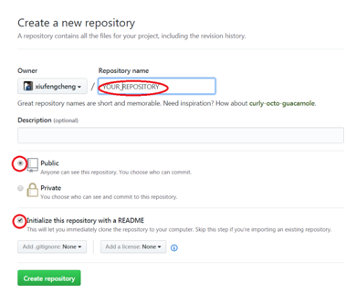   

* 你会发现你多了一个仓库  
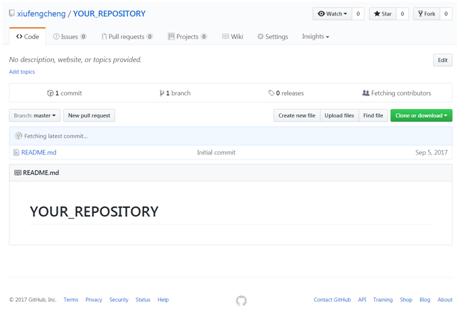  

* 以后登录网站，进入自己的主页面，需要点击右上角   的图像，选择Your Profile 就可以看到自己建的所有仓库了。  
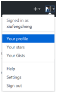  

## Step 4. Fork别人的仓库
* 首先登陆你的账号
* 找到一个人的主页，然后找到他的仓库
* 老师的仓库在这里[https://github.com/xiufengcheng/DATASTRUCTURE](https://github.com/xiufengcheng/DATASTRUCTURE)
* 点击右上角的Fork

* 然后等待...等fork成功后，会自动跳转到你fork过来的你自己的远程仓库页面。

## Step 5. 使用Git Desktop工具
 GitHub有两种工具，一种是**git**本身，这个用百度搜索git第一个就是，点击下载，下载后右键菜单里就会出现**Git bash here**菜单，它是命令行工具，可以用它来做更加细致的工作。 

 另一种是相对简单的图形界面操作工具**GitHub Desktop**，这两种工具的作用都是一样的，只是操作方法后者更为简单易用。在这里我们只介绍GitHub Desktop。

### [下载GitDesktop](https://desktop.github.com/)

* 安装完成后，你会看到桌面上的快捷方式  
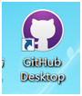  

* 第一次打开它时，输入你的GitHub的账号和密码  
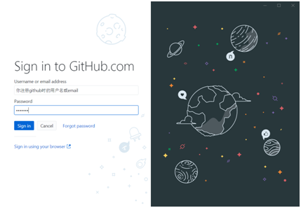  

## Step 6. 克隆/下载仓库 (Clone or Download)
* 你当然可以直接从网页上下载，找到你fork过来的仓库(也可以是别人的任何仓库)，点击右边绿色的Clone or download
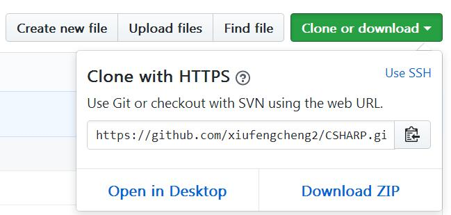 

* 建议使用Gitdesktop进行下载，这样很多事情后来会比较便利。选择File->Clone Repository，将**你的远程仓库**(注意，是**你的远程仓库**，如果克隆老师的仓库，你后来是没有权限push到别人仓库上的，除非他加你为collaborator)克隆到**你的电脑上**(也叫"本地",就是你觉得合适的目录，通常为D盘或者E盘)，例如E:\DATASTRUCTURE。 
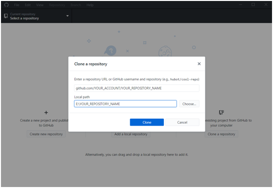  
* 点击Clone开始克隆，克隆完成后，你的本地就有一个下载下来的仓库，并且这个仓库和**你的**远程仓库同步。
* 其实，你也可以克隆任何人的任何仓库到你的本地，但是推荐先fork他，然后再clone你自己fork过来的仓库。

## Step 7. 更新本地仓库
* 你可以在你的本地电脑上更改东西(增删改等操作)。

## Step 8. 将本地更新推送(Push)到你的远程仓库
* 更改好后，你可以将本地版本Push到**你的远程仓库**, 如何push呢？
* 很简单，本地代码有任何的变动，GitHub Desktop是会有察觉的。 
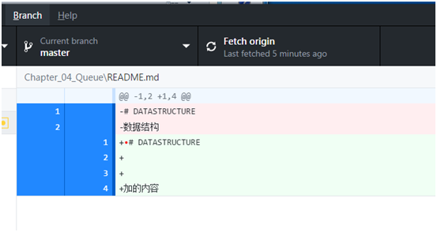
* 其中红色带减号的部分表示删除的内容，加号部分表示增加的内容  
* 在左下角的summary中填上你更改的说明情况，然后点击左下角的Commit按钮  
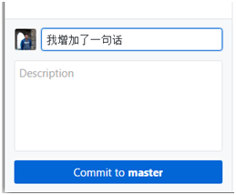

* 然后再点击右上角的Push按钮  
  

## Step 8.1. 将本地更新推送(Push)到别人的远程仓库
* 其实，你可以push的远程仓库有两类，一类是自己的仓库(已讲)，一类是别人的仓库(这些仓库加了你为collaborator) 。
* 这里又引申出一个问题，如何往自己的某个仓库中添加collaborators呢？在这里：
  
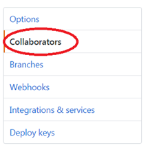  

## Step 9. 将远程仓库同步到本地（Fetch/Pull）
* 这里的Fetch也就是Pull, 点击Fetch按钮(和Push按钮的位置一样)，就可以刷新本地仓库了！

## Step 10. 向原创者发起pull request  
* Git是一个很强大的工具，其中重要的一点就是可向任何人发起Pull Request，首先看下工作原理吧：
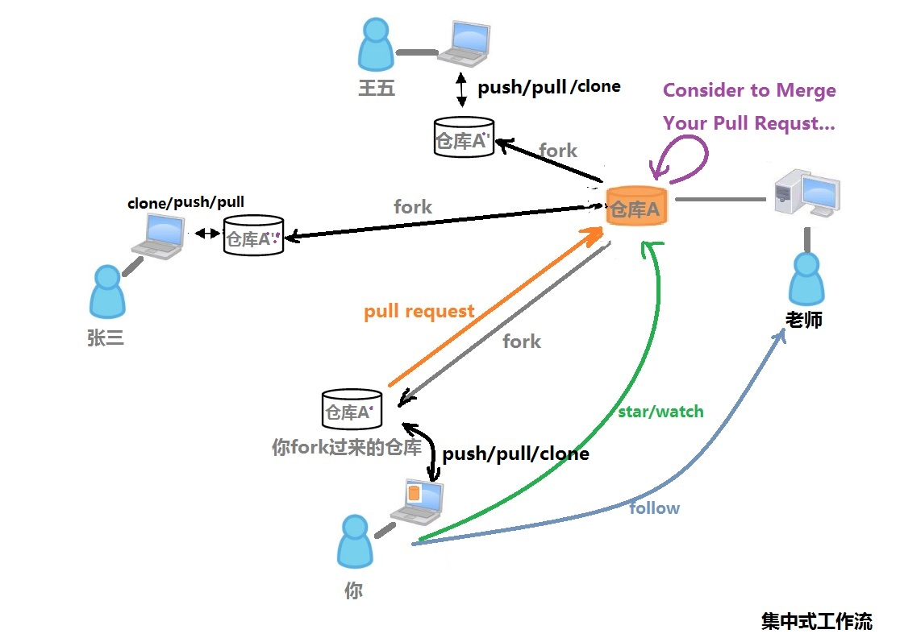 

* 首先，你必须fork别人的某个仓库，这样，你的远程仓库中拷贝了一份和别人一模一样的仓库。怎样区分是你自己的还是别人fork过来的仓库呢？看下图。找出图标的区别。  
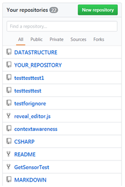  

* 然后，Push到自己远程工作做完后，你的**远程仓库**和**原作者的远程仓库**是两个版本了不是？
* 这时候，你就需要发起Pull Request到原作者，请求他合并(Merge)
* 具体做法：网页上进入你fork过来的远程仓库，点击New Pull Request  

* 填写该填写的东西，提交给原创作者。接下来的事就交给原创作者自己定夺了

* 期间，可能还有原作者不满意，退回修改的过程

* 有关更详细的git指南请参考
[**Git工作流**](https://github.com/xirong/my-git/blob/master/git-workflow-tutorial.md)  

